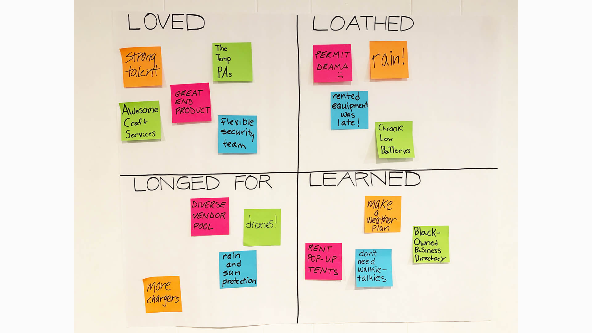

<!--more-->

## 定义

4Ls 回顾是在冲刺或项目完成后的团队活动，旨在了解工作的情况、不足之处以及可以改进的地方。4Ls 代表享受/喜欢（Liked）、学到的（Learned）、缺少的（Lacked）和渴望的（Longed For）。

## 应用场景

在冲刺/项目结束后，团队停下来回顾发生的事情是很有帮助的。4Ls回顾是一个有效的工具，可以赋能团队同时去关注冲刺/项目过程中积极正面和消极负面的内容，从事实出发，而不是从情感的角度思考

## 如何操作

在每个冲刺/项目结束时，团队将就上述四个方面（喜欢、学到的、缺少的、渴望的）在关键工作流中提供意见。

目标是获得一个重点改进的优先列表，为重点工作领域指定负责人，以构建信任、提高效率，并在计划下一个冲刺时增加参与。

**示例议程**

* 介绍: 启动 4Ls ，清晰定义活动，明确研讨会日程与目标。
* 收集: 时间上限的活动，让参与者在数字协作工具（例如 Miro）中记录上一个冲刺/项目阶段中的喜欢、学到的、缺少的和渴望的内容
* 分类: 总结和归类成主题
* 优先级: 在有限的时间框内，让参与者对重要的经验提出投票
* 下一步: 为基于优先级而确定的下一步改进活动，明确责任人。人员重组来进一步沟通分享，与客户团队和领导团队对齐，并计划如何在下一个冲刺中实施

**研讨会日程**

举行视频会议：

* 计划60分钟
* 介绍 - 5 分钟
* 收集 - 15-20 分钟
* 分类 - 10 分钟
* 优先级 - 10 分钟
* 下一步 - 10 分钟

请使用摄像头、聊天，随意使用举手功能。

Miro 画板：

* 参与者访问数字协作工具，如 Miro 画板。
* 画板分为四个象限，分别代表喜欢、学到的、缺少的和渴望的。可以根据需要通过编辑协作画板（例如 Miro）来调整象限的数量，以反映工作流。
* 在“收集”环节，参与者使用“便利贴”发布喜欢、学到的、缺少的和渴望的内容
* 在“分类”环节，团队一起沟通对其主题（例如规划、技术、领导力、沟通等）
* 在“优先级”环节，参与者使用“投票按钮”选择确定最重要的、可实施的改进。

## 引导 4Ls 回顾

* A - 设定基调和预期*

在开始回顾之前，请确保所有参与者了解其目的。如果要反思的冲刺/项目令人感到有压力，请在开始回顾之前坦率地解决这个问题。最成功的回顾是在团队完全认同其重要性和价值时完成的，因此，组织者在开始之前必须格外小心，确保这一点已经发生。

* B - 确定对冲刺/项目的喜欢之处*

4Ls 回顾的第一步旨在揭示人们对冲刺/项目的喜欢之处, 预期这一步可以获得广泛而开放的反馈。这故意是广泛且开放性的。组织者可以引导参与者逐渐深入了解他们喜欢的事物以及为什么喜欢。目标是为了揭示特定事物为什么被喜欢的根本原因，以确保在下一个冲刺/项目中再次发生。

* C - 确定学到的东西*

最有价值的经验通常来自于在完成实际工作时犯的错误或克服的挑战。不幸的是，这些经验往往不会与团队分享。回顾的这个元素要求参与者反思并分享他们可能学到的任何内容。

重要的是要确保组织者明白，没有哪个学习太小而不能分享，同时引导人们发现比他们意识到的更多的学习。

* D - 揭示缺少的东西*

此步骤旨在揭示在冲刺/项目中阻碍团队前进的所有问题。这可能是与外部团队的沟通速度较慢，也可能是需要额外分析才能解决的更复杂的问题。在冲刺/项目中记录缺少的东西的目的是确保您在未来的冲刺/项目中不会遇到相同的问题。

参与者常常在感觉到领导不想听这些内容时感到不愿分享缺少的东西。这可能是因为他们认为解决方案过于昂贵或耗时，不值得投资。无论哪种情况，再次由组织者确保在此步骤中，团队感到舒适，能够在最大程度上分享内容。

* E - 记录渴望的内容*

4Ls 回顾的最后一个元素涉及对渴望的事物进行反思。这可能是有形的，如更好的设备，也可能是不太明确的，如更多或更少的领导参与。

注意，“渴望的”部分不应仅仅是缺少部分的镜像。虽然它们通常会相似，但它给您提供了一个机会，可以基于它可能产生的积极影响来确定和优先考虑所需的内容。例如，如果“更快的计算机”列在“缺少的”部分中，那么在这一步中并不一定只能加入“更快的计算机”。您还可以考虑将“更快的互联网”或“更好的软件”作为其他可以解决缺少的东西的内容。

* F - 成功进行 4Ls 回顾的5个提示*

1. 给人们提供时间和空间来反思。用30-60分钟的无打扰时间来让他们梳理想法。
2. 要求每个人关闭不相关设备，以便他们可以专注于回顾。如果被手机或笔记本电脑分散了注意力，将更难进行反思。
3. 向所有人保证没有正确或错误的答案。这不是一个测试！如果人们感觉无法就工作情况提供诚实反馈，回顾将无法发现有价值的见解。
4. 鼓励团队关注行动，而不是情感。目标是收集客观的反馈和反思。如果待回顾的冲刺非常紧张，请考虑在举行回顾之前进行象征性的总结活动，以缓解紧张氛围，提高情绪。（深呼吸，轻拍背部）
5. 在难度较大的冲刺之后，使用 4Ls 回顾将远程团队聚集在一起，以便在没有限制的情况下进行协作。远程团队通常会感到孤立，缺乏正式的总结和反思会损害士气。举办在线回顾不仅能够拉近团队之间的距离，还能够发现什么是具有挑战性或压力的，以确保下一个冲刺更顺利地进行。

* G - 任务分配和跟进*

这可能是回顾过程中最重要的一步。如果您不花时间将后续行动分配给特定的人员或团队，那么完成过程后将不会获得太多收益。

在结束回顾之前，请明确志愿者承担的任务和责任。对于没有志愿者的任何后续行动，请将其分配给在回顾中揭示洞察力最多的人员。通过确认每个人明白未来的预期行动是什么，并感谢他们的时间来结束会议。
## 相关资源



> 作者：Sherri Scheurich
> 原文链接：<https://openpracticelibrary.com/practice/4ls-retrospective/>
