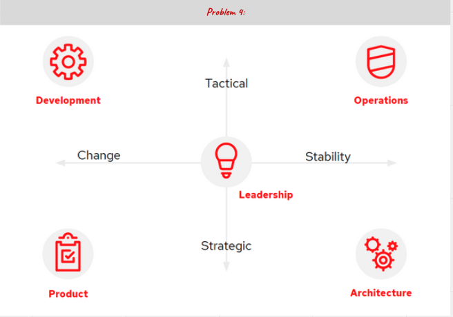
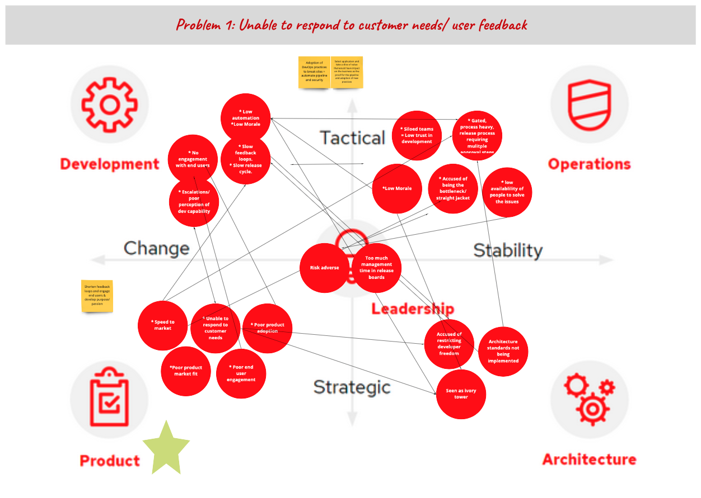

<!--more-->

## 定义

它是一个帮助人们深入理解问题复杂性的工具，可以明确问题的痛点、来源、负责人，并最终推导出用于设计实验的用例。

## 应用场景

经常地，组织内的团队只从他们的孤立视角尝试解决复杂问题。

例如，开发团队为了提高上市速度而采用敏捷实践，但发现前后的工作仍在使用传统的瀑布方法。结果是水-敏捷-瀑布，它没有解决问题。

另一个例子是，基础设施运营团队通过引入Kubernetes平台来提高上市速度，但他们没有考虑到他们的客户（软件工程师）从平台中需要什么，而是基于运营团队的想法。结果通常是一个花费过长时间构建、并且不提供开发者需要的功能的过度设计的解决方案，这就是"梦之田"的方法，但这次他们建立了，但没有人使用。

**5元素画布的目的是帮助识别在尝试独立解决相似问题的团队/孤立之间存在的共同兴趣和利益区域。** 这将使他们能够确定他们可以使用哪些实践来培养共情、共享理解，并最终合作提供一个每个人都热衷于交付的解决方案。

实践的成果将取决于您的角色和与所有利益相关者的关系，它们包括：

* 降低孤立墙和合作障碍
* 扩大你的利益相关者团队
* 通过深入理解他们的问题来培养与利益相关者的共情
* 获得与他人交谈的权利
* 支持利益相关者将他们面临的问题提交给领导/预算持有人。

## 如何操作

没有固定的方法比其他方法更好，这通常取决于你与不同团队的关系以及你可以从利益相关者那里获得的时间。

画布的第一次迭代可以与利益相关者一起或者不与他们一起完成。

5元素画布。元素包括：开发、运营、领导、产品和架构

**步骤：**

1. 确保团队对挑战有共同的理解。使用诸如'目标成果'的其他实践可能会有帮助。
2. 设定一个5分钟的计时器，专注于您的利益相关者团队；例如，运营。
3. 将观察到/推断出/假定的与挑战相关的痛点用便签贴出（参见下面链接的静默头脑风暴/脑写）。
4. 延长时间，使用亲和力映射来整合回应。
5. 绘制线条以显示痛点的因果关系；例如，过多的技术债务会有一个因果线从产品那里，因为确定进入冲刺的工作优先级是产品所有者的责任。
6. 再次设定计时器并移至下一个利益相关者团队，理想情况下跟随箭头的来源。从他们的角度识别他们的痛点和问题。
7. 重复，直到涵盖所有的利益相关者团队。

按照这七个步骤，将会深入理解问题，痛点的因果关系，对每个利益相关者团队的共情，并有一个能够促进对话的画布。

这个练习最好是直接与不同的利益相关者团队一起完成，但这并不总是可能的。首先进行练习，然后使用画布验证您与不同利益相关者的理解是一个很好的替代方法。你将与你的利益相关者验证这一点，所以不必100%正确！利益相关者会觉得你做了你的功课，并验证/指出缺失的内容更有可能获得参与；在这种意义上，你赢得了与他们交谈的权利。

画布帮助每个团队理解并与其他团队共情，明确他们自己不能解决这个复杂的问题。这可以扩大你的利益相关者团队，团队可以向你介绍另一个团队的关键成员，或者帮助在不同的团队之间促进对话。

验证后，使用画布作为跳板，识别可以促进孤立能力之间的合作的用例或实验是相对直接的。

  **示例如下:**

## 延伸资源

查看以下精选链接，这些链接可以帮助您更深入地与您的团队、客户或利益相关者一起实践5元素画布。

* 首先，一个明确定义的目标成果/问题陈述对这种实践至关重要。<https://openpracticelibrary.com/practice/target-outcomes/>
* 共情地图可以帮助初步收集痛点。<https://openpracticelibrary.com/practice/empathy-mapping/>
* 为您的会议提供更好的输入。<https://openpracticelibrary.com/practice/silent-brainstorming-brainwriting/>

作者：Chris Baynham Hughes

原文链接：[<https://openpracticelibrary.com/practice/4ls-retrospective/>](https://openpracticelibrary.com/practice/5-elements-canvas/)
