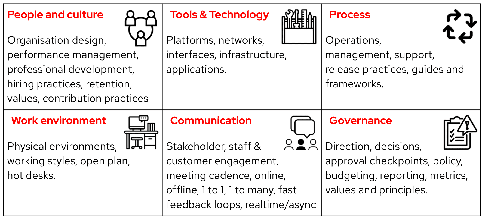

<!--more-->

## 定义

这是一种通过引导的信息收集活动，旨在探索、记录并优先考虑组织、团队或项目中当前挑战和亮点，跨越六个相互关联的维度。

* 人与文化
* 工具与技术
* 流程
* 沟通
* 工作环境
* 治理

**是的，这些维度之间存在一定的交叉。**

人们在治理过程中，需要根据其文化和环境使用工具和技术进行沟通。这里的目标不是将所有事物完美地归类到每个维度中，而是要思考我们在这些不同维度上的亮点和挑战。

*对这些重叠部分进行辩论，也可以产生出可行的见解和解决方案。*

这种做法最初侧重于挑战，但已经适应了探索亮点。亮点在书籍[《Switch: How to change, when change is hard》](https://heathbrothers.com/books/switch/)中有描述，并与[赞赏式探询](https://en.wikipedia.org/wiki/Appreciative_inquiry)亦有互通之处。

## 应用场景

为什么要进行“发现的六个维度”？快速建立对特定举措背景的共识，揭示组织、团队或项目中的痛点（挑战），以及揭示应该利用的技能和优势（亮点），以加快走向[目标结果](https://openpracticelibrary.com/practice/target-outcomes/)的脚步。

## 如何操作

要求小组**思考**他们目前的亮点和挑战，然后让他们将这些**分类**到这六个维度中。

所有参与者应将他们的挑战分别写在**便利贴**上，然后将它们**贴**在相关维度的墙上。

引导者或小组中的志愿者应审查、归类并总结这些回应（[亲和映射](https://openpracticelibrary.com/practice/affinity-mapping/)），然后要求每个人回来，通过投票来选择出最紧迫的挑战是那些，并集中关注最相关或最有用的亮点。

**可选**

在投票时，您可以使用两种不同颜色的点来创建优先级矩阵：重要和紧急、工作量和影响、风险和价值等等。

**关注重点**

确保对小组应如何以及在哪里集中注意力达成一致。

* 是从他们自己的个人视角？还是从他们对别人如何看待他们的挑战的感知？
* 是对组织？团队？项目？还是技术？
* 您是在记录当前状态吗？（问题）还是在考虑可能阻碍期望状态的挑战？（风险）
* 您是在考虑团队内的亮点技能、优势、流程？还是在更广泛的组织中可能可用于帮助的情况？

**是按顺序进行，还是一次性完成？**

方式 A： 每个人都同步地按照每个维度，一起作为一个小组进行，每个维度花费5分钟。

或者。

方式 B： 每个人独立工作30分钟，填写所有6个框架，然后在最后一起审查每个维度。

**现场**

需要的工具： 标记笔、便利贴、粘性点、粘性展示板纸张、足够的墙壁空间。

用于远程引导：Mural模板

设置：准备带有这六个维度的展示板纸张，并贴在墙上，或将一个大白板分成6个区域。给每个人提供一些：投票贴纸、便利贴和记号笔。

###  6 个维度的定义

大多数人可以快速理解每个维度，不需要太多解释就可以直接开始任务，但有时有必要定义这些术语、讨论差异并提供示例。以下可能是帮助建立共识的有用起点或参考，供那些需要的人使用。

以下是这些术语的一些常见定义，但它们对您和团队意味着什么？您可以将这些作为讨论的起点，或作为澄清的参考。

#### 1 人与文化

组织设计，绩效管理，专业发展，招聘实践，人员保留，贡献实践

*“文化”是什么意思？*

* “特定群体或社会的思想、习俗和社会行为。”；
* “在适合生长的条件下维持物体的生长。”（常见的生物学定义。）
* “文化对于人类集体来说，就像个性对于个体一样。”（霍夫斯特德）

#### 2 工具与技术

平台，网络，接口，基础设施，应用程序。

*“工具和技术”是什么意思？*

* “技术是知识和一般概念或想法，而工具是我们如何应用它。例如，火是一种技术，而棍子、火柴、打火机、燃料、风箱是我们如何应用、管理和维护这项技术。”
* “技术：利用知识进行实际目的。”
* “工具：用于执行特定功能的设备、工具或应用程序。”

#### 3 流程

运营，管理，支持，发布实践，指南和框架。

*“流程”是什么意思？*

* “为实现特定目标而采取的行动或步骤。”
* “工作完成方式涉及的步骤和决策。”
* “为了实现特定结果而启动的相互关联的工作任务。”
* “用于完成特定任务的标准化工作流程。”

#### 4 工作环境

物理工作场所，工作方式，开放式办公区，共享工位，远程/分布式。

*“工作环境”是什么意思？*

“工作时的所有周围环境。您的物理工作环境包括工作工具、空气、噪音和光线等。但您的工作环境还包括组织工作的心理方面以及您在工作中的幸福感。”

#### 5 沟通

利益相关者，员工和客户参与，会议节奏，线上，线下，一对一，一对多，快速反馈循环，实时/异步。

*“沟通”是什么意思？*

* “通过说话、听、写、阅读或使用其他媒介传递或交换信息。”
* “成功传达或分享想法和感情。”
* “发送或接收信息的方式，例如电话或计算机。”

#### 6 治理

方向，决策，批准检查点，政策，预算编制，报告，度量标准，价值观和原则。

*“治理”是什么意思？*

* “在公司内部和外部行使和控制权威的规则、关系、系统和流程框架。”
* “权威，问责制，管理，领导，指导和控制。”
* “用于验证对项目影响的方向和决策程序和指标。”

致谢 [David Worthington](https://www.linkedin.com/in/david-worthington-2b65b84/) 和 [Arash Dadras](https://www.linkedin.com/in/arash-dadras/) 向我们介绍了这个实践。

作者：Donna Benjamin

原文链接：<https://openpracticelibrary.com/practice/6-dimensions-of-discovery/>
