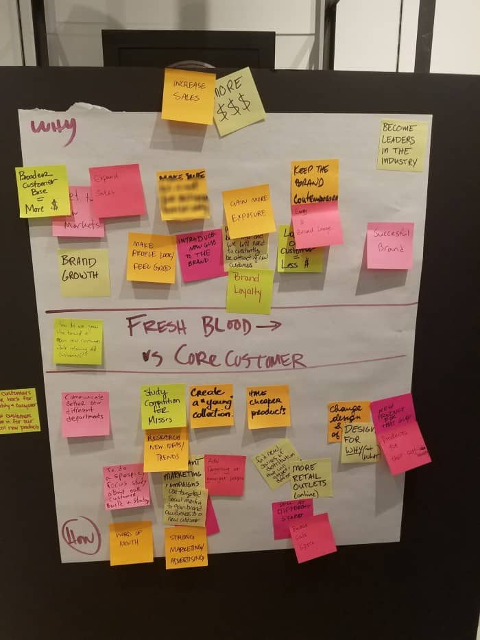

<!--more-->

## 定义

抽象梯度法是一种问题框架活动，参与者通过扩大或缩小焦点重新审视问题陈述。参与者通过头脑风暴和探索从初始问题陈述中产生的“为什么”和“如何”陈述，以探索背景、可能性，并可能重新构架原始问题陈述，使其更引人入胜或更广泛。

## 应用场景

花时间探索给定的问题陈述可以帮助您以更有创新思维的方式重新构思陈述。当然，有时在这项活动结束时决定最初的问题陈述是最好的，在这种情况下，您至少探讨了其他选项以验证当前的措辞。但在许多情况下，问题陈述会以一种方式重新措辞或重新构思，从而扩大创造性解决方案的可能性，为更多的想法提供空间，增加解决方案的创造潜力。

## 如何操作

促使此实践的步骤：

### “为什么”框架

识别一个初始问题陈述
在白板上或数字白板工具上（如果远程引导），绘制具有多个横档的梯子。如果亲自引导，请确保每个参与者都有一个便签和一支马克笔
在中间的横档上写下初始问题陈述
要求小组写下为什么这是一个问题的3个原因，每个原因写在自己的便签上
将相似的便签在白板上聚类在一起，并向小组展示它们。用新的便签重新措辞集群，以捕捉该集群中所有便签的本质
给小组3个点，让他们投票选出他们最喜欢的问题陈述
将前3张便签放在梯子的下一横档上
重复步骤4至7，为新的问题陈述再做2次

### “因果关系”框架

回到最初的问题陈述，询问小组写下3件回答“这引起了什么问题？”的事情
将相似的便签在白板上聚类在一起，并向小组展示它们。用新的便签重新措辞集群，以捕捉该集群中所有便签的本质
给小组3个点，让他们投票选出他们最喜欢的问题陈述
将前3张便签放在梯子的下一横档上
重复步骤1至4，为新的问题陈述再做2次

### 问题陈述选择

到目前为止，您已经获得了一系列相关的问题陈述，从更抽象的（在梯子顶部）到更具体的（在梯子底部）。在最后一轮投票中，让每个团队成员选择他们认为最值得解决、能够产生最大影响的问题陈述。

选择得票最多的陈述，现在您已经准备好构思解决方案了！

## 延伸资源

* [Using Abstraction Laddering: How to Build the Right Question and Stick to it](https://medium.com/the-conversation-factory/using-abstraction-laddering-how-to-build-the-right-question-and-stick-to-it-c0efb012248e)
* [Up and Down the Ladder of Abstraction](https://medium.com/@tombarrett/up-and-down-the-ladder-of-abstraction-cb73533be751)
* [Abstraction Laddering Mural Template](https://www.mural.co/templates/abstraction-laddering?utm_medium=paid-search&utm_source=adwords&utm_campaign=201101-Templates_-_Facilitator_Superpowers&utm_adgroup=Templates_-_Business_Model_Canvas&utm_campaign_id=11208697402&utm_content=&utm_adgroupid=110300560016&gclid=Cj0KCQjwmIuDBhDXARIsAFITC_4HvAlkNxU62JIpCkiz435JiymWZJ9JT1958Ym1F6Rd3bSYj21Pv9caAsd0EALw_wcB)

> 原文作者

* Jerry Becker

* 

> 原文链接：https://openpracticelibrary.com/practice/abstraction-laddering/