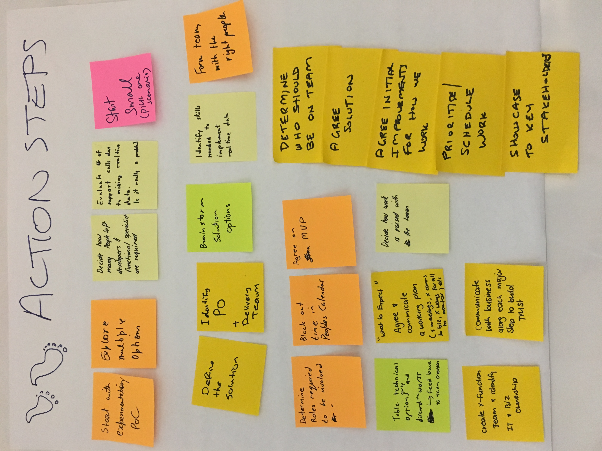

<!--more-->

> 参与人数： 3 或者更多

> 时长: 10 - 40 分钟

> 难度: 容易

> 参与人员: 团队

## 定义

承诺行动：这是一种协作实践，鼓励每个人承诺迈出行动的第一步。

* 受“一千里之行始于足下”理念的启发，行动步骤让人们思考他们将如何继续共同开始的工作，并承诺采取具体行动。
* 灵感来自 De Bono 的“行动鞋”。

## 应用场景

有时会议会变成纯粹的讨论，没有实际行动。

这个快速简便的实践能让人们思考下一步的行动，并将讨论转化为实际行动。

它也是结束工作坊的理想方式。

## 如何操作

1. **讨论**：请每个人反思已经完成的工作，以及他们在会议后将如何继续。
2. **书写**：让每个人写下（或打字）
   * 谁 - 姓名
   * 什么 - 要采取的行动
   * 何时 - 完成的时间和日期
   * 与谁 - 在某人的帮助下完成、审查或庆祝
3. **朗读**：让每个人大声朗读他们的卡片，并请求在场的某人提供帮助。
4. **审查**：使用[亲和图法](https://openpracticelibrary.com/practice/affinity-mapping/)对行动步骤进行分类和总结。如果有很多行动要执行，可以投票决定最重要的优先事项。

行动步骤可以在回顾会结束时或任何产生大量想法的活动后使用，让人们明确从哪里开始，以及接下来要做什么。

## 参考示例

.jpg)

## 延伸资源

* Six Action Shoes - Dr. Edward de Bono : <https://www.debono.com/Books/Six-Action-Shoes>

> 原文作者

* Donna Benjamin

* 

> 原文链接：[<https://openpracticelibrary.com/practice/abstraction-laddering/>](https://openpracticelibrary.com/practice/action-steps/)
