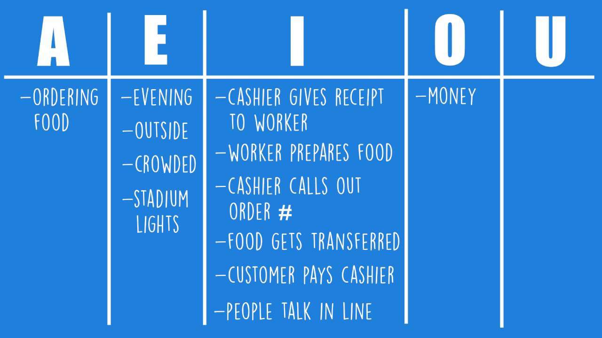
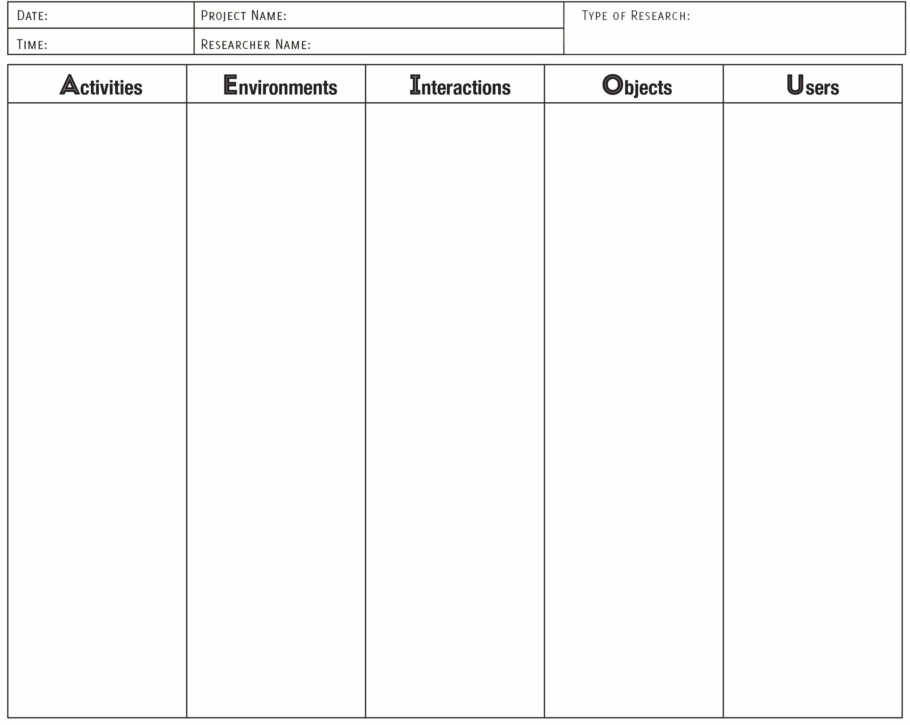
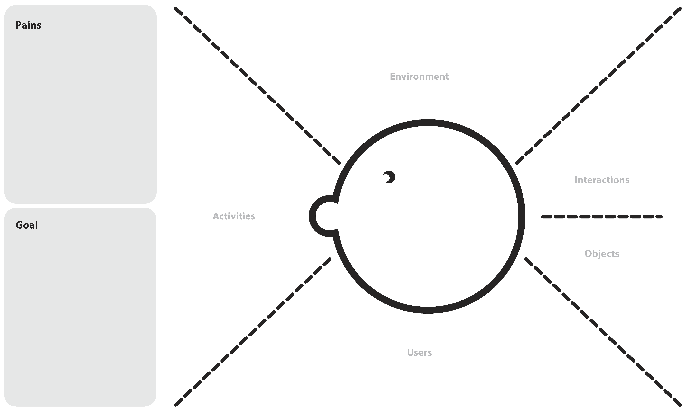

<!--more-->

> 参与人员: 2+ ，产品负责人、项目经理、研究员

> 时间: 1+ Hours

> 难度: easy

## 定义

[TheDesignExchange.org](https://thedesignexchange.org) 制作了一个简短的视频，在不到一分钟的时间里介绍了 AEIOU 观察框架，请点击下方图片观看：

以上 YouTube 视频介绍了所有内容，作为参考，AEIOU 代表：

* **A - 活动**
* **E - 环境**
* **I - 互动**
* **O - 对象**
* **U - 用户**

这个启发式框架提供了一种用于记录民族志研究中上下文调查的观察技术。对于数字产品和软件实践，AEIOU 有助于在用户研究实地研究和可用性测试中分类和解释观察结果。

AEIOU 作为一个缩略词，为如何进行定性研究观察提供了一个易于记忆的助记符，也能迅速将原始笔记分类，从而为研究分析提供信息，发展出关键洞察和其他发现。

## 应用场景

AEIOU 涉及在用户访谈期间需要观察和记录的五个启发式类别，为如何捕捉研究数据提供了指南。以下是每个类别的简要定义：

* **活动**：人们为达到目标采取了哪些行动和行为？
* **环境**：活动发生的总体环境是什么？人们在环境中的行为如何？
* **互动**：人们为达到目标进行的基本互动是什么？人们对活动和环境有何影响？
* **对象**：构成环境的所有细节是什么？对象如何与人、活动和互动相关？
* **用户**：被观察的对象是谁？他们的个性如何？他们如何与他人互动以达到目标？

AEIOU 是研究工作的起点，以上类别定义可以根据项目目标进行迭代和细化。[Rick E. Robinson](https://www.epicpeople.org/building-a-useful-research-tool/)，AEIOU 的创建者，称其为一种“分类启发法”，可以进行修改。

## 如何操作

将 AEIOU 用作观测框架。

### 如何使用 AEIOU 进行上下文调查？

AEIOU 提供了一个模板，用于观察上下文调查和收集定性数据。只需使用框架创建一个工作表，研究人员可以在实地使用它。它将有助于收集观察数据，此外还有其他民族志方法如音频、照片和视频。

工作表设计可以是一个简单的文字处理文档，每个部分留出记录笔记的空间，或者像这个示例一样，用类似于电子表格的列进行组织：

工作表也可以设计得有趣一些，比如这个同理心地图示例：

### 如何将 AEIOU 作为一种方法论？

虽然 AEIOU 并非专为指导方法论而创建，但它也可以为进行用户研究提供指导。

在技术性详细讨论指南的探索性研究中，数据收集通常是广泛的，后期分析将定义信息类别。在这种情况下，AEIOU 可以作为一种方法，用于团队在启发式观察策略和规划研究数据收集方面达成一致。

**专家提示**：在讨论指南封面页包含一节，简要概述要观察的内容。这是提醒观察者和记录员在用户访谈期间职责的有用提示。这些要点是一个很好的示例，可以根据项目目标进行修改或添加：

* AEIOU 框架（活动、环境、互动、对象、用户）
* 捕捉你看到的（参与者的肢体语言、使用的工具等）
* 捕捉你听到的他们的话（引言、故事、关键词、矛盾等）
* 捕捉你感觉到用户的感受（情绪、信念、困惑、热情等）

### 便利贴

**前提知识**
了解研究目标有帮助。

**交付物**
工作表将用于包括在研究分析活动中。

**物品清单**

* AEIOU 工作表
* 打印机

## 延伸资源

* [Building a Useful Research Tool: An Origin Story of AEIOU](https://www.epicpeople.org/building-a-useful-research-tool/)
* [AEIOU Framework](https://help.ethnohub.com/guide/aeiou-framework)
* [Free Column Worksheet](http://www.libraryuxtoolkit.com/search.html#flyOnTheWall)
* [Free Empathy Map Worksheet](https://www.creatlr.com/template/1knjaTEkdFHvtBOLr8DAx/aeiou-empathy-map/)

## 相关实践

* [Empathy Mapping](https://openpracticelibrary.com/practice/empathy-mapping/)

> 原文作者

* Darcie Fitzpatrick

> 原文链接：[<https://openpracticelibrary.com/practice/aeiou-observation-framework/>](https://openpracticelibrary.com/practice/aeiou-observation-framework/)
