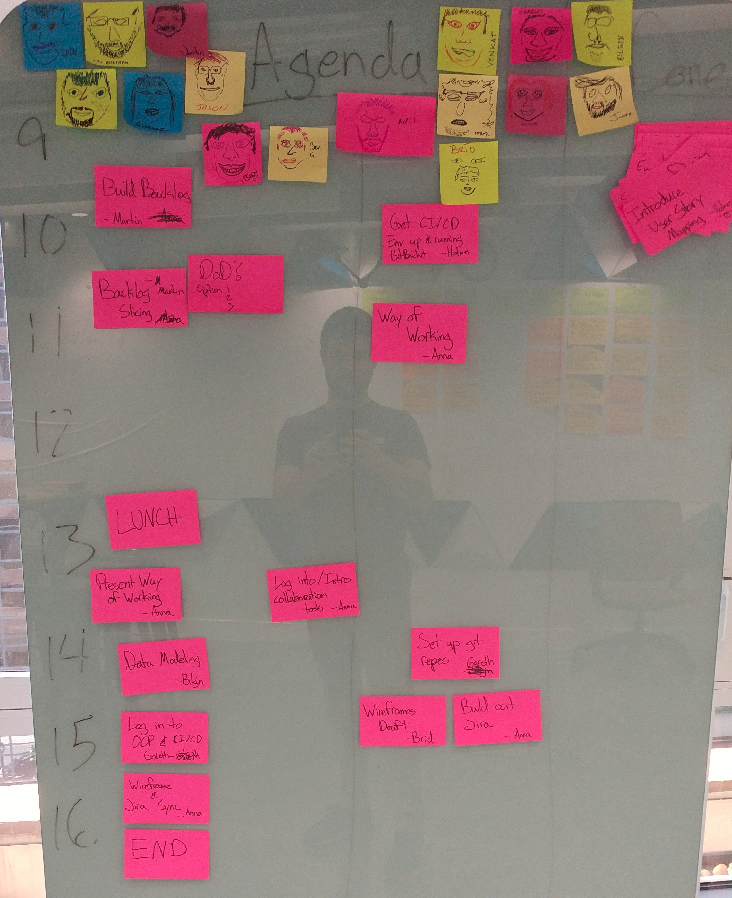
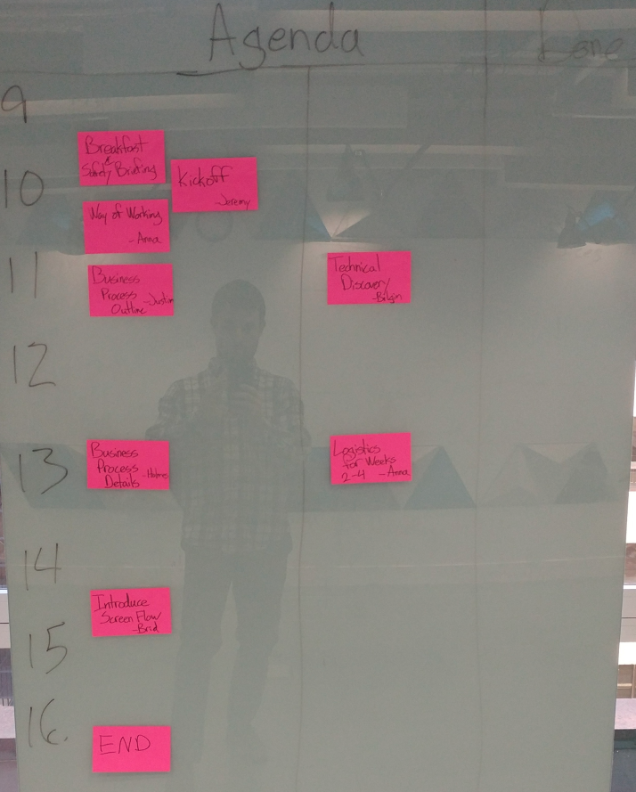
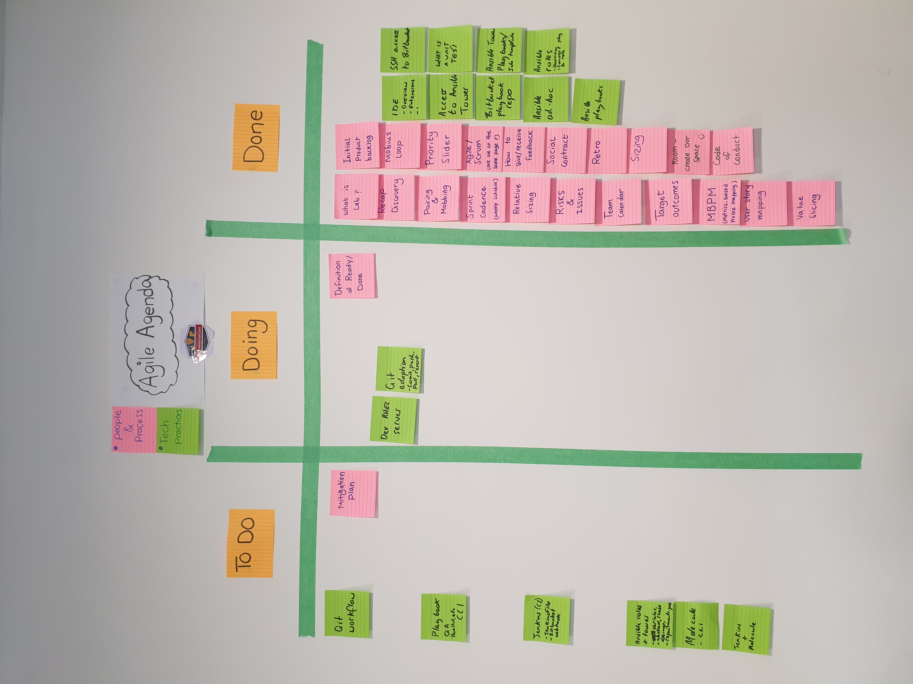

<!--more-->

> 参与人员: 2+

> 时间: 10 分钟

> 难度: 简单

> 参与者: 主持人、与会者

## 定义

Agile 议程是一种简单而有效的方式，使用便签和白板来管理面对面工作坊的议程。基本思路是在白板上绘制一个日程表，然后将其分成两个或多个部分。之后，将议程项目（和负责人）写在便签上，然后将它们放在白板上的相应时间段。早上回顾你的议程，并在一天中随时更新它。它应该看起来像这样：

## 应用场景

* 像[事件风暴](/practice/event-storming/)或[用户故事地图](/practice/user-story-mapping/)这样的会议不容易适应时间框，因此你需要动态管理议程。
* 白板和便签比需要某些格式或可能存在访问问题的数字议程更容易更改。
* 它作为整个工作坊的信息辐射器[1](#footnote-1)，使其成为团队聚集回顾议程和检查时间的理想区域。相比之下，记录在幻灯片中的议程不自然地导致团队聚集。

## 相关实践

* 协作绘脸[2](#footnote-2)是一个很好的破冰或午后活动。活动结束后，Agile 议程可以成为这些脸的一个不错的展示平台，如下所示：

## 所需材料

* 可以放置便签的白板。
* 白板笔。
* 便签（最好有多种类型）。

## 延伸资源

1. [信息辐射器](http://scrumbook.org/value-stream/information-radiator.html) 在 ScrumBook.org 上。
2. [协作绘脸](http://www.funretrospectives.com/collaborative-face-drawing/)。

> 原文作者：

* mtakane
* tdbeattie
* Zenigata

> 原文链接：[Agile Agenda](https://openpracticelibrary.com/practice/agile-agenda/)
