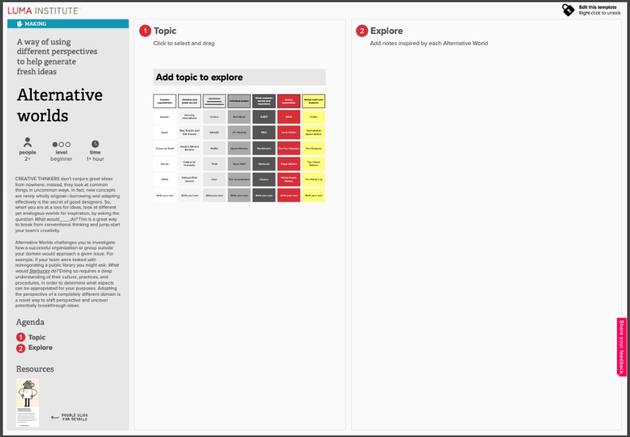
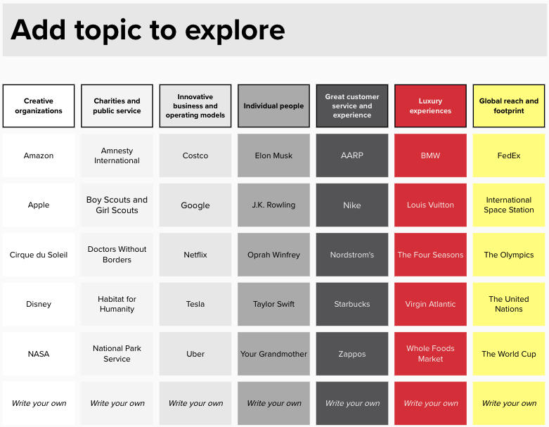

<!--more-->

> 参与人员: 产品团队

> 人数: 1-10+

> 时间: 15-60 分钟

> 难度: 简单

## 定义

LUMA Institute 最好地总结了这个有价值的头脑风暴活动的定义——“替代世界”是一种通过不同视角帮助产生新想法的方法。创造性思维者不会凭空想出伟大创意；相反，他们以不同寻常的方式看待普通事物。

替代世界是一种练习，让你的团队故意从不同的角度（一个名人、另一个个人、一个创造性组织等）解决问题。它帮助团队打破在个人背景下解决问题的心理障碍，打开产生伟大创意的新可能性。

## 应用场景

作为主持人，我们经常被要求支持团队和领导者寻找新颖和不同的想法来解决棘手的问题。对参与者来说，要摆脱自己的视角是很困难的——他们常常让真实或想象中的限制阻碍他们思考新想法的能力。

替代世界赋予参与者发展新想法的自由。

## 如何操作

虽然这个活动有许多变种，但我下面描述的方法对我来说效果最好。

***在你开始之前…***

- 清楚地表达你正在解决的问题——你的问题陈述是什么？

***材料：***

- 纸张/白板/翻转图表
- 记号笔
- 便签纸
- 计时器（可选）

***一步一步***

1. 将参与者分成4-5人的小组。
2. 每个小组头脑风暴代表创新问题解决者的实体（公司、品牌、人物）。
   \- 使用便签纸，每个实体一个
3. 每个小组讨论他们生成的列表，并识别小组内每个人都知道的实体。
4. 每个小组从他们的列表中选择一个创新问题解决者。
   \- 变种：你可以包括一个步骤来回顾/分享每个人的灵感，以确保没有两个小组使用相同的灵感。
5. 让每个小组头脑风暴以下问题的答案：\_\_\_\_\_\_\_\_ 会如何解决我们的问题陈述？
   \- 使用便签纸，每个想法一个
6. 使用另一种基于视觉的主持小组过程分析你的想法（如[亲和图](https://openpracticelibrary.com/practice/affinity-mapping/)或[影响/努力优先级](https://openpracticelibrary.com/practice/impact-effort-prioritization-matrix/)）

## 延伸资源

- [Luma Institute](www.luma-institute.com)

> 原文作者

- graphicfacilitator
- heyjerrybecker

> 原文链接: [Alternative Worlds](https://openpracticelibrary.com/practice/alternative-worlds/)
