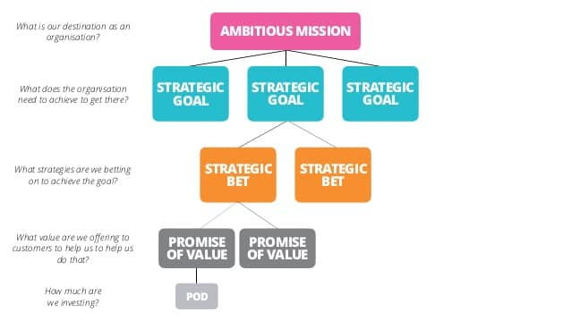

一种用于对齐不同业务层级间的人员与举措的简单工具。 
<!--more-->
## 难度

> 中等

## 参与者
  - 产品负责人
  - 团队
  - 高层管理人员

## 定义
精益价值树（简称：LVT）是一个概念工具，可用于组织不同层级和团队间共享战略与愿景，并促进和驱动战略与愿景的逐级分解与实施。

## 应用场景
LVT是对精益投资组合管理的增强，它以价值交付为基础，利用[精益方法](https://www.lean.org/whatslean/)，鼓励协作。它充分发挥[精益投资组合管理](https://www.scaledagileframework.com/lean-portfolio-management/)中可视化的优势，识别与客户价值和企业愿景紧密融合的举措，并引导决策，规避浪费时间和预算的不合理举措。

## 如何操作
精益价值树遵循自上而下的框架结构：**愿景** > **战略目标** > **投注** > **举措**
  
公司愿景被分解为一组战略目标，战略目标随后被分解为一系列投注，每一个投注被细分为多个价值流和具体的、有目标产出的举措，从而自下而上驱动目标与愿景的达成。

  

  #### 目标

  LVT目标应具有战略性和远大的，与企业愿景对齐。聚焦于高端的产出收益，而不应是具体的方案或输出这种战术性目标。
  

  #### 投注

  每个目标被分解为一组战略投注。每个投注对应一个价值假设，组织层相信投注对应的价值假设可以让企业达成战略目标。如果某个投注无法实现预期价值，则将其剔除出价值树，从而确保时间不会浪费在一些不能实现愿景的事情上。特意使用“投注”这个词，是为了强制思维方式从[VUCA](https://en.wikipedia.org/wiki/Volatility,_uncertainty,_complexity_and_ambiguity)旧模式的转变。

  #### 举措

  举措定义了如何去验证投注对应的价值假设。它一般从某个维度或更小的假设视角去执行验证，从而可以更清晰去度量假设是否达成。通过这些举措，我们做出短期决策，决定继续或者终止某个价值假设（或投注）。
 
  举措不是项目。项目和举措的区别是，项目有固定交期，但是举措一般是没有交期要求的。举措应随着不断假设演变和优先级调整的产品待办而被持续验证，直到整体举措被证明或证伪。

  精益价值树要保持组织级的可视化，同时被精益投资组合委员会定期评审，这一点非常重要。通过持续评审，实现举措、投注和目标的改进、整合或移除，确保全局最优。

  此外，精益价值树还应该明确每一层目标、投注和举措的责任人和执行人，从而形成多样化的团队并激励他们达成目标、获得成功。

  #### 战略 vs 日常运营

  诚然，精益价值树聚焦于战略举措。然而在实践中，任何组织都会经历这种左右为难的困境，将精益价值树只用于战略举措？还是让其覆盖日常运营举措与战略举措？（一般来讲，日常运营举措会占精益投资组合的80%-90%）。

  只聚焦战略举措可以更好的实现战略愿景。但是排除日常运营举措在外，可能会引起业务部门间的不和谐，导致缺乏足够的动力去达成战略举措。

  基于组织规模，在某些场景下，100%的覆盖精益投资组合是可行和有效的，只要这个举措对战略愿景有助，这对于中小型企业而言非常适合。在大规模组织中，不同的部门和层级，应聚焦不同的战略举措或日常运营举措（比如经营层聚焦在战略举措）。最重要的是，精益价值树实践贯穿于投资组合管理，不管是战略举措还是日常运营举措，要确保组织举措管理方法的一致性。

  精益价值树是管理精益投资组合的强大工具，也是组织形成敏捷适应能力的关键。而且这是一个协同项目管理办公室（PMO）参与数字化转型的绝好机会，从传统的项目聚焦转变为聚焦在LVT的投注与相关价值假设。

  进一步推进阅读：《EDGE：价值驱动的数字化转型》，作者Jim Highsmith，Linda Luu，David Robinson。

 ## 延伸资源
   - [什么是精益？](https://www.lean.org/whatslean/) 
   - [精益投资组合管理](https://www.scaledagileframework.com/lean-portfolio-management/) 
   - [维基百科VUAT：易变性，不确定性，复杂性与模糊性](https://en.wikipedia.org/wiki/Volatility,_uncertainty,_complexity_and_ambiguity)
   - [ThoughtWorks:精益企业战略PPT](https://www.slideshare.net/OllieStevensonGoldsm/strategy-in-a-lean-enterprise)

> 原文作者
 
 
 
 
 - Francisco Meza Guzman
 - PUBLISHED JULY 07, 2020
 
> 原文链接： <https://openpracticelibrary.com/practice/lean-value-tree/>