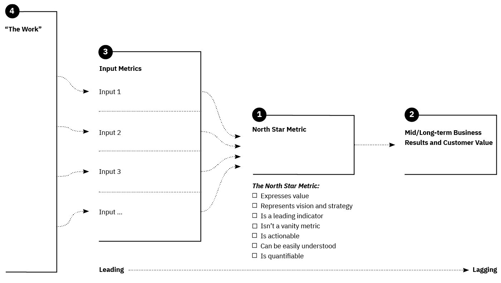
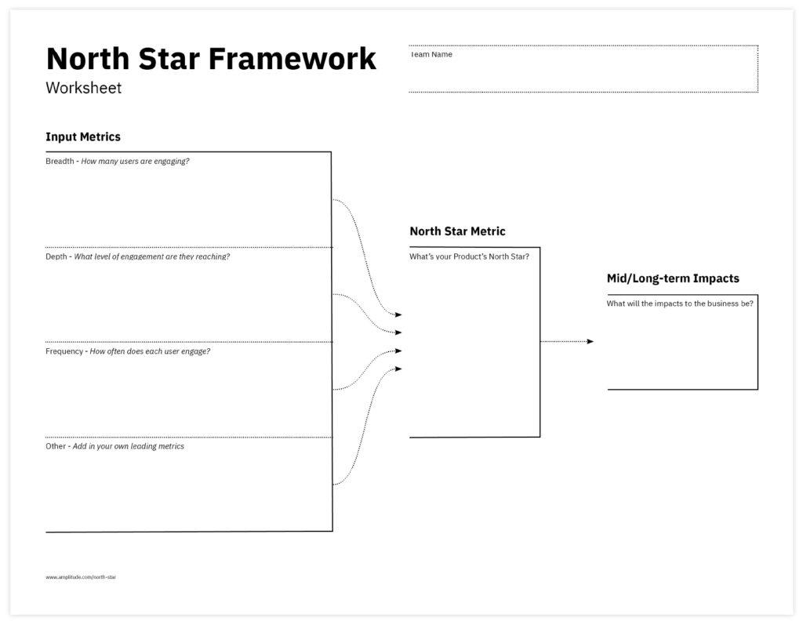
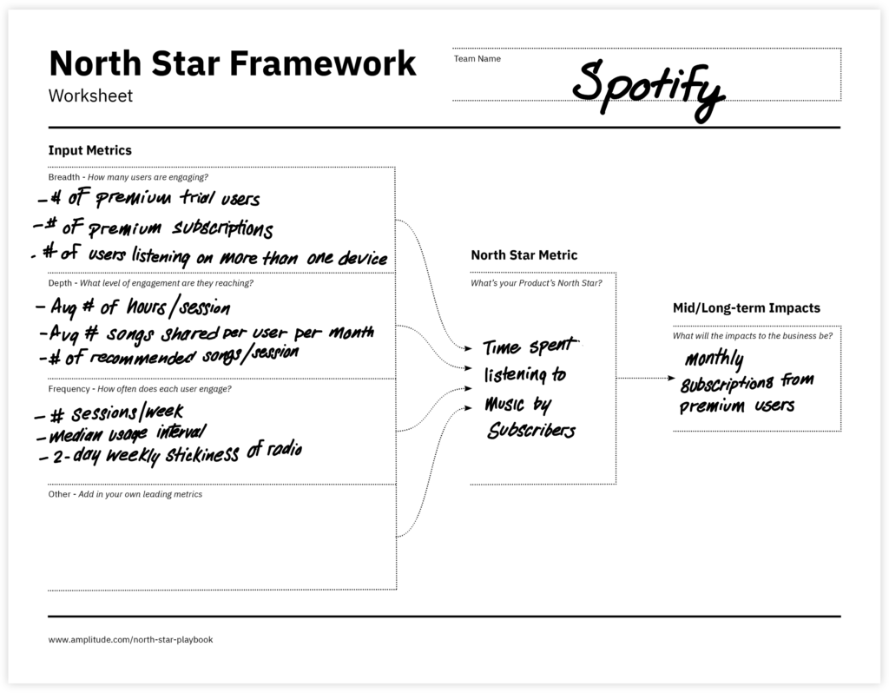
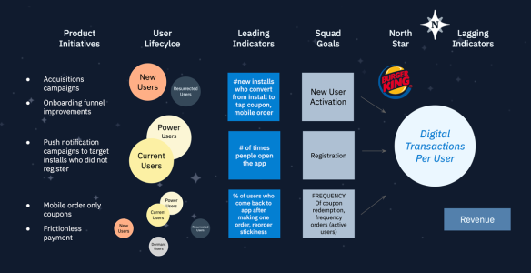

<!--more-->

## 定义

通过设定一个“北极星”（North Star），可以帮助产品实现统一目标。北极星框架是一种管理产品的模型，它通过识别唯一一个关键指标来实现，即“北极星指标”。根据提出这一理论的学者Sean Ellis所述，这个指标是最能体现出产品给客户带来的核心价值的指标。

这个框架对于产品决策、以及与产品相关的组织运营决策同样有用，如客户支持、客户成功、产品营销。决策的替代方案也会从该框架指标的角度去评估影响和可行性。

## 为何要使用北极星框架？

北极星框架是将战略转化为具体的产品和组织决策的理想工具，以明确且可衡量的方式评估这些决策对实现战略的效果。

在发现循环中使用北极星实践可以帮助团队朝着正确的方向出发，并在所有成员和利益相关者之间实现对齐。如果团队一直没有北极星，它也可以帮助团队进行航向修正或重新对齐。将北极星的信息放在墙上，清晰地展示给团队成员和相关利益相关者看， 可以帮助持续关注，并引导团队朝着它的方向前进。

[Amplitude](https://amplitude.com/north-star) 是一家数字分析公司，它发布一个免费且系统的北极星框架手册，介绍了它是什么，为什么使用它以及如何使用它。

以下是关于北极星指标的七个检查清单要点：

1. 它体现价值。我们可以在其中看到对客户的重要性。
2. 它代表了愿景和战略。公司的产品和业务战略都可以反映在其中。
3. 它是成功的指引指标。它预测未来达成的情况，而不是体现过去的成果。
4. 它是可操作的。我们可以采取行动来影响它。
5. 它是易于理解的。它用朴实的语言来表达，非技术合作伙伴也能理解。
6. 它是可测量的。我们可以通过测量技术手段来跟踪产品，从而获取数据。
7. 它不是虚荣指标。当它发生变化时，我们可以确信这种变化是有意义和有价值的，而不仅仅是一些不能真正预测长期成功的东西，即使它让团队感觉良好。

## 如何操作

使用北极星框架的团队会识别一个有意义的指标和一组有助于实现目标的输入。产品团队的工作会影响这些输入，进而驱动指标实现。北极星是可持续发展的指引性指标，在产品和业务运营直接起到链接作用。

为了帮助找到一个北极星，我们可以使用简单的画布，例如Amplitude手册中提供的画布。

在团队/组织中，如果对北极星框架不熟悉，可能需要考虑以下几个不同的主题，从而实现框架的落地：

1. 理解战略和成功的关键指标
2. 理解客户旅程以及价值创造和价值实现的关键时刻和事件
3. 分析指标，包括转化指标，以确定关键事件和时刻的指引指标，即确定您的北极星指标
4. 通过评估和将指标与所有提案、产品待办中的关键特性和OKR等相链接，构建北极星框架

如果选择的北极星指标不能符合前面提到的所有要点，您将面临在业务上产生有限影响的风险，浪费宝贵的时间、精力和资源。对整个社会技术系统的持续评估对于取得良好的结果是必不可少的。

## 参与人员

虽然没有预先定义的人员名单，但这个活动是将组织与战略对齐的关键。所以您需要确保邀请代表不同视角的人员参与，以下是建议的角色列表最小集：

1. 产品负责人/部门负责人
2. 产品经理/团队
3. 产品团队
4. 销售主管/负责人
5. 产品营销
6. 客户成功
7. 技术支持

## 建议的时间

尽可能多的时间，但需要设定时间框架（60-120分钟）。

有经验的团队和主持人可以在120分钟内完成所有步骤。其他人可能需要进行几次研讨会，以在完成框架之前就关键问题达成一致。

## 需要的主持材料

一个白板和足够的便利贴。

数据，数据，数据 - 将所有数据与用户旅程的背景联系在一起。

## 远程会议的建议

使用虚拟白板。功能更强大的虚拟白板效果更好。我们喜欢Miro.com。

## 相关实践

北极星框架与发现环节中的许多实践非常契合：

1. 影响地图
2. 服务蓝图
3. 旅程地图
4. OKR（目标关键成果）

作为评估决策的关键方法，北极星可以与选项转向阶段（the Options pivot）的做法很好地结合：

1. 设计冲刺
2. 优先级矩阵
3. 价值切片
4. 待办事项优化

## 示例

## 延伸资源

查看这些出色的链接，它们可以帮助你更深入地了解如何与你的团队、客户或利益相关者一起运用北极星框架实践。

* [Amplitude playbook](https://amplitude.com/northstar)
* [ProductFolio.com articles](https://productfolio.com/northstar-framework/)
* [Amplitude North Star Template Library](https://miro.com/app/board/uXjVPf0HwEA=/)

本文作者：

* 
* 

原文链接：<https://openpracticelibrary.com/practice/north-star-framework/>
